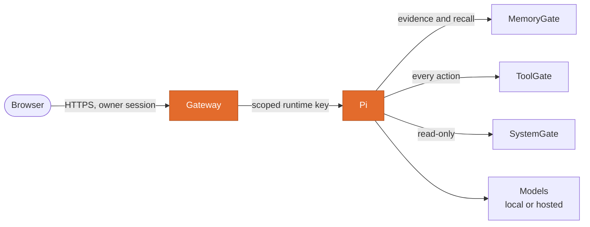

<p align="center"></p>
<h1 align="center">Pi</h1>
<p align="center"><b>Conker's runtime: conversations, model choice, tool calls and an append-only record of every turn.</b></p>
<p align="center">
  <a href="https://github.com/Conker-AI/pi/actions/workflows/ci.yml"></a>
  
  <a href="LICENSE"></a>
  <a href="https://github.com/Conker-AI/conker"></a>
</p>

Pi runs each conversation turn: it gathers memory, picks a model, lets the model call tools through
ToolGate, and records what happened. The same image ships the **Gateway**, the only thing a browser
ever talks to. Part of [Conker](https://github.com/Conker-AI/conker), a personal AI companion you
host yourself.

## Where it fits



**Pi coordinates; it never owns.** It keeps conversations and execution history, nothing more.

- Memory belongs to **MemoryGate**. What crosses over is derived evidence, never the transcript
  ([ADR-0002](https://github.com/Conker-AI/conker/blob/main/docs/adr/0002-transcripts-and-evidence.md)).
- Actions belong to **ToolGate**. Pi has no shell and no file access of its own
  ([ADR-0005](https://github.com/Conker-AI/conker/blob/main/docs/adr/0005-toolgate-is-the-only-action-path.md)).
- Machine state belongs to **SystemGate**, read-only.
- The Gateway holds the owner's login and approval credentials; Pi never sees them
  ([browser authentication](docs/browser-auth.md)).

Why build it rather than adopt a runtime: [ADR-0001](https://github.com/Conker-AI/conker/blob/main/docs/adr/0001-build-pi-in-house.md).

## Three rules the code enforces

**History is append-only.** No runtime function updates or deletes a message, and database triggers
refuse both, so nothing reaching past the API can rewrite what was said. The owner can still
[forget a conversation](docs/forgetting.md) through a separate command that removes content and
leaves a content-free receipt.

**Long conversations fork; they are never truncated.** When history outgrows the model's window,
the session closes with a summary and a linked child continues. Nothing is silently dropped.

**An action that happened is never recorded as one that didn't.** If a tool runs and the model then
fails to reply, the turn is `acted_no_reply`, not `failed`, and resuming asks only for the reply. A
turn needing approval *parks*, and resuming replays the exact stored action the owner saw.
[More on turns](docs/turns.md).

## Quick start

Requires Docker with Compose.

```bash
cp .env.example .env
echo "PI_ADMIN_KEY=$(openssl rand -base64 24)" >> .env
docker network create conker_net   # once; shared with the other Conker services
docker compose up -d --build
```

The development API is on `http://127.0.0.1:8050` with `X-Pi-Key: <PI_ADMIN_KEY>`. In a full
Conker deployment the worker stays unpublished and only the Gateway reaches it, through an explicit
allowlist of operations. Pi refuses to start without a key of at least 16 characters.

## Configuration

Precedence is environment, then file, then default. The essentials:

| Variable | Default | Meaning |
|---|---|---|
| `PI_ADMIN_KEY` | *(required)* | At least 16 characters, or Pi will not start. |
| `PI_DB_PATH` | `/data/pi.db` | Conversations and history. **Back this up**: MemoryGate's evidence cites its message IDs. |
| `PI_OLLAMA_URL` | `http://ollama:11434` | The local model server. |
| `PI_MODEL` | `qwen3:4b` | The local model for ordinary conversation. |
| `PI_OPENROUTER_KEY` | *(empty)* | Optional hosted models. Without it Pi answers locally and says so. |
| `PI_ALLOW_PAID_MODELS` | *(off)* | Off means free models only, enforced in code. |
| `PI_TOOLGATE_URL` | `http://toolgate-api:8010` | The action boundary. |
| `PI_TOOLGATE_KEY` | *(empty)* | A scoped ToolGate key. Without it Pi acts on nothing and reports `not_configured`. |
| `PI_LOCAL_TIMEOUT_S` | `600` | Catches a hung server, not a slow model. Local inference can take minutes. |

Every variable is in [`.env.example`](.env.example).

## API at a glance

| Route | |
|---|---|
| `GET /health` | Probes the store and the model provider. No key. |
| `POST /sessions` · `GET /sessions` · `GET /sessions/{id}` | Open, list and read conversations. |
| `POST /sessions/{id}/turns` | Run one turn. Your message is stored even if the model fails (503). |
| `POST /sessions/{id}/fork` | Close with a summary and continue in a child. |
| `GET /tools` | What Pi may do right now, as ToolGate sees it. |
| `GET /approvals` · `POST /turns/{id}/resume` | Turns waiting on the owner, and continuing them. |
| `GET /turns/unreplied` | Turns that acted but never reported back. |
| `GET /models` | Models Pi can route to now, free and paid. |

Full reference: [Pi OpenAPI](docs/pi-openapi.json) · [Gateway OpenAPI](docs/gateway-openapi.json).
Every turn records provider, model, tokens, cost and latency; an unknown price shows as unknown,
never as zero. How the model is chosen: [routing](docs/routing.md).

## Development

```bash
pip install -r requirements-dev.txt
python -m pytest -q
ruff check . && ruff format --check .
```

The owner-terminal tests need Linux; everything else runs anywhere.

```text
pi/        Runtime: turn loop, store, routing, memory outbox, jobs, proposals
gateway/   Browser-facing HTTPS gateway: login, sessions, allowlisted routes
tests/     Unit, contract and live-gateway tests
docs/      One document per feature
```

## Documentation

Start with [turns](docs/turns.md) and [routing](docs/routing.md), then the
[feature index](docs/README.md), with one page per capability: memory, forgetting, jobs, proposals,
attachments, projects, recovery and more.

## License

[MIT](LICENSE)
